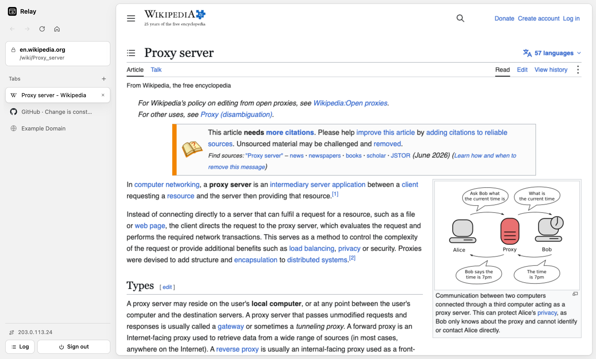

<p align="center">
  
</p>

<h1 align="center">relay-browser</h1>

<p align="center">
  A self-hosted private web browser that runs inside your browser.<br>
  Every page loads through your own server, so websites only ever see the server's IP address.
</p>

<p align="center">
  <a href="LICENSE"></a>
  <a href="https://github.com/masghar/relay-browser/actions/workflows/ci.yml"></a>
  
</p>

<p align="center">
  
</p>

relay-browser is a small Node.js app you deploy on a server you control: a VPS, a
shared host with Node support, a home server. Open it, sign in with a password, and
you get a tabbed browser in the page. Every request a page makes goes from *your
server* to the site, never from your own machine. Pages run in a locked-down sandbox,
trackers are blocked, and nothing is kept once you sign out or close the tab.

It started as a way to check how sites behave when seen from a server's IP and
location: DNS changes, geo-restricted content, IP allowlists, CDN routing. It grew
into a private browser for everyday use.

## Features

- **Browse from your server's IP.** Pages, images, scripts, API calls, form posts and
  video are fetched server-side. Your own IP address is never sent to the sites you
  visit, and the `X-Forwarded-For` headers your host adds are stripped.
- **Tabs, history and search.** Tabs live in a sidebar, and each has its own
  back/forward history. Links that open a new window open as a new tab. Anything that
  isn't an address is searched with DuckDuckGo.
- **Pages are sandboxed.** Each page runs in its own opaque origin. It can't read the
  browser UI, other tabs, or your session, and the UI can't read what you type into a
  page.
- **Nothing is left behind.** Site cookies and storage live in memory for that page
  only. Nothing is written to the HTTP cache, and signing out or closing the tab
  clears everything the app stored, on the server and in the browser.
- **Trackers are blocked.** Known ad and analytics networks are blocked on the server,
  `utm_*`, `fbclid`, `gclid` and similar parameters are removed, and `DNT` and
  `Sec-GPC` are sent with every request.
- **Works with modern sites.** Static HTML and CSS are rewritten, and a small script
  injected into each page covers URLs built at runtime (`fetch`, XHR, `import()`,
  `history.pushState`, dynamically added elements). YouTube, GitHub, Wikipedia and
  news sites render properly.
- **Video streaming.** HTTP range requests are passed through for seeking, and HLS
  (`.m3u8`) and DASH (`.mpd`) manifests are rewritten.
- **Small and dependency-light.** Three runtime dependencies (Express, cheerio,
  dotenv). No database, no build step.

## Quick start

You need Node.js 18 or newer.

```sh
git clone https://github.com/masghar/relay-browser.git
cd relay-browser
npm install
cp .env.example .env    # then set APP_PASSWORD
npm start
```

Open <http://localhost:3000> and sign in with the password you set.

### With Docker

```sh
docker build -t relay-browser .
docker run -d -p 3000:3000 -e APP_PASSWORD='choose-a-long-password' relay-browser
```

## Configuration

Settings come from environment variables (or a `.env` file):

| Variable       | Required | Default | Description                              |
| -------------- | -------- | ------- | ---------------------------------------- |
| `APP_PASSWORD` | yes      |         | Password for the sign-in page.           |
| `PORT`         | no       | `3000`  | Port to listen on.                       |

There is no other state to configure. Sessions are kept in memory and end when the
tab closes, after 30 minutes without activity, or after 12 hours.

## Deploying

relay-browser runs anywhere Node.js does. A few things to get right:

1. **Use HTTPS.** Put it behind a TLS-terminating reverse proxy (nginx, Caddy, your
   host's built-in HTTPS). The app trusts the first proxy hop for the client IP and
   the protocol.
2. **Set a strong `APP_PASSWORD`.** The app is an open-ended URL fetcher. Without the
   password gate it would be an open proxy, which gets hosting accounts suspended.
   Five wrong passwords from one IP lock it out for 15 minutes.
3. **Run a single process.** Sessions are in memory, so don't load-balance across
   several instances without sticky sessions.

Some hosting front ends replace `Content-Security-Policy` response headers with their
own. relay-browser also puts its page policies in `<meta>` tags and refuses to show a
proxied page outside its sandbox, so it stays safe behind such hosts.

## How it works

```
  your browser                         your server                       the web
 ┌──────────────────────────┐        ┌──────────────────────┐         ┌───────────┐
 │ browser UI (/app/)       │        │ relay-browser         │         │           │
 │  ├─ tab: sandboxed frame ├───────►│  /p/<token>/https/... ├────────►│ example   │
 │  └─ tab: sandboxed frame │◄───────┤  rewrite + filter     │◄────────┤ .com      │
 └──────────────────────────┘        └──────────────────────┘         └───────────┘
```

- **URLs.** A page at `https://example.com/a/b?c` is served from
  `/p/<token>/https/example.com/a/b?c`. The path layout means relative URLs built by
  the page's own scripts resolve back through the proxy with the right host and
  directory. The token is random per session and tied to the IP that signed in.
- **Rewriting.** HTML attributes, `srcset`, inline styles, CSS `url()` and `@import`,
  `<base>`, import maps, and HLS/DASH manifests are rewritten on the server
  (`src/rewrite.js`). Redirects are handed to the browser with a proxied `Location`.
- **Runtime shim.** `src/clientShim.js` runs first in every page. It routes the URLs
  that scripts create after load, and gives the page in-memory cookies, storage and
  locks. It also turns off autofill and cloud spell-check in forms.
- **Stray requests.** If a script still requests a root-relative path like
  `/api/items` on the app's own origin, the server uses the `Referer` to find which
  proxied page asked, and redirects to that path on the right site.
- **Isolation.** Proxied pages carry a CSP `sandbox` policy and load in a sandboxed
  `<iframe>` without `allow-same-origin`. The UI and a page talk only through
  `postMessage` (address, title, icon, "open in new tab").

## Privacy and security model

What relay-browser guarantees:

- Your IP address is not sent to the sites you visit. A page's content security policy
  only allows connections to your server, so even a URL the rewriting misses can't
  reach a third party directly.
- The browser UI can't read page content, keystrokes or clicks, and pages can't reach
  the UI, other tabs, or the app's API.
- Nothing persists in the browser. The only cookie is the sign-in cookie. It is
  `HttpOnly`, `SameSite=Strict`, and deleted when the browser closes.
- Sign-out and closing the tab destroy the session and its request log on the server,
  and send `Clear-Site-Data` so the browser deletes cookies, storage and cache. The
  sign-in page sends the same header every time it loads, as a backstop.
- Nothing is written to disk on the server.

What it can't control:

- Your own browser and its extensions see whatever is on screen.
- Your hosting provider's web server may log the URLs requested from it, including
  the `/p/...` paths that reveal which sites were visited.
- The sites you visit see your server's IP and, like any proxy, can tell they're
  being loaded through one.

Found a security problem? See [SECURITY.md](SECURITY.md).

## Limitations

- **Signing in to websites.** Cookies from sites are not kept, so you won't stay signed
  in to them, and cookie banners may reappear on each page.
- **WebSockets** are not proxied, so chat apps and live dashboards that depend on them
  won't work.
- **`location` can't be faked.** A script that reads `location.hostname` sees the
  app's domain. Most sites don't care; a few single-page apps do.
- **Downloads and pop-up windows** are disabled by the sandbox. Links that would open
  a new window open as a tab instead.
- **Reloading the app page ends the session.** Reloading counts as closing.
- **DRM-protected video** (for example Netflix) will not play.

## Keyboard shortcuts

Shortcuts work while focus is in the browser UI, not inside a page. Browsers keep
Ctrl+T and Ctrl+W for themselves, so the tab shortcuts use Alt.

| Shortcut              | Action                  |
| --------------------- | ----------------------- |
| Ctrl/Cmd+L, F6        | Go to an address        |
| Ctrl/Cmd+R, F5        | Reload or stop          |
| Alt+T                 | New tab                 |
| Alt+W                 | Close tab               |
| Alt+1 … Alt+9         | Switch to tab           |
| Alt+← / Alt+→         | Back / forward          |

## Project layout

```
src/
  server.js      Express app: routes, security headers, stray-request fallback
  auth.js        Sign-in, rate limiting, sign-out and close handling
  session.js     In-memory sessions, proxy tokens, per-session request log
  proxy.js       The /p/ route: upstream request, filtering, rewriting, streaming
  proxyUrl.js    /p/ URL encoding and decoding, tracking-parameter removal
  rewrite.js     HTML/CSS/HLS/DASH rewriting (pure functions)
  clientShim.js  Script injected into every proxied page
  blocklist.js   Tracker and ad hosts
public/
  app/           The browser UI
  login/         Sign-in page
  icons/         Favicon and app icons
test/            node:test unit tests
```

## Development

```sh
npm install
npm test        # unit tests (node:test, no extra dependencies)
npm start
```

Contributions are welcome. See [CONTRIBUTING.md](CONTRIBUTING.md) for how to set up,
test and send changes.

## FAQ

**Is this a VPN?**
No. A VPN routes all traffic from your device. relay-browser only proxies the pages
you open inside it, and it needs nothing installed on your device.

**How is it different from a remote browser or a headless browser service?**
Pages still run in your own browser, only the network requests go through the server.
That makes it light enough for a small VPS or shared hosting, and it keeps video and
scrolling smooth.

**Can I use it to test geo-blocking, DNS changes or IP allowlists?**
Yes, that's what it was first built for. Deploy it in the region or network you want
to test from and open the site.

**Does it hide me from the websites I visit?**
They see your server's IP instead of yours, and trackers are blocked. They can still
see anything you choose to type or sign in with.

## License

[MIT](LICENSE) © Muhammad Asghar
